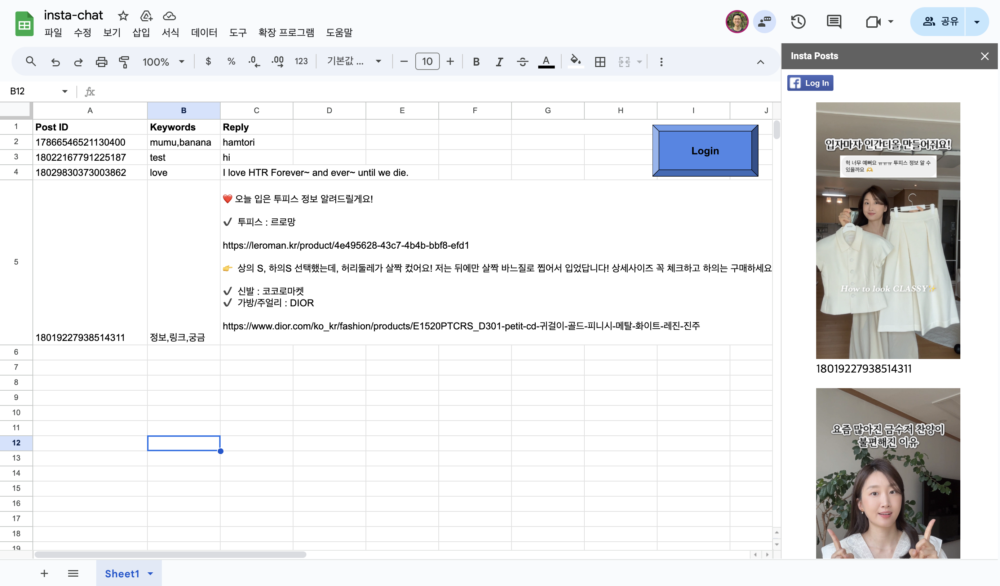

# insta-chat

The simplest Instagram chat automation tool made with Google Sheets, for my wife.

+ 60 lines of Javascript (`Code.gs`, `index.html`) for the frontend
+ 60 lines of Python for the backend (`bot.py`)
+ Made with <3

# Background

My wife is a [Youtuber](https://www.youtube.com/@bambigirltv)/[Influencer](https://www.instagram.com/hi_bambigirl/?hl=en).

One day, I saw her about to subscribe to an Instagram chat automation
tool for $15/month.

She needed to automatically reply to comments containing specific 
keywords, with a predefined message.

"Baby, I can make this for you in 2 weeks", said I. Turns out, I only
needed 3 days.

# The Tech

I'm convinced now almost all web apps can be an Excel file.

With [Apps Scripts](https://developers.google.com/apps-script), 
you can build full-on websites in your Google Sheets.

I embedded custom HTML with the FB Login JS Button. My wife uses it to log in
and I populate the sidebar with her Instagram posts.

Whatever my wife puts in for the automations, my `bot.py` script 
running in the cloud periodically reads the Google sheets and sends
the desired message to her followers.

# The Aftermath

My wife cancelled her subscription. We are now saving $15/month. She loves me more now :) 

## I also want something like this.

The backend only works with my wife's google sheet. Email me if you're interested in having something similar.
If there's enough interest, I will build an actual web app for this.